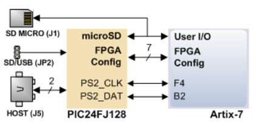

# <center>实验七	状态机与键盘输入<center>


## <center> 姓名：徐沐杰   <center>

## <center> 学号：211240088   <center>

## <center> 班级：1班   <center>

## <center> 邮箱：211240088@smail.nju.edu.cn   <center>

## <center> 实验时间：2022.11.10   <center>


# 实验七	状态机与键盘输入

## 1.实验目的

设计一个状态机，实现键盘按键的 `ASCII` 码与状态码显示。

## 2.实验原理

键盘通过 ps/2 接口同我们的状态机进行交互，键盘上每个键有所谓扫描码，如果单独得到一个扫描码表示该键摁下，如果扫描码在断码 `F0` 之后到来，那么表示该键松开。

|  |  |
| :--: | :--: |
| ps/2 接口简览 | 键盘扫描码 |

## 3.实验环境/器材

**硬件：** Digilent Nexys A7-100T开发板（原Nexys 4 DDR），核心芯片为 Xilinx Artix-7 FPGA芯片

**软件：** Vivado 2022.1 ML Standard

## 4.程序代码或流程图

#### 顶层模块

```verilog
module lab07(
    input wire clock100MHZ,
    input wire [15:0] SW,
    input wire ps2_clk,
    input wire ps2_data,
    output wire [15:0] LED,
    output wire [7:0] AN,
    output wire [7:0] HEX
);

    wire reset = SW[0];

    wire clock10KHZ;
    wire clock10MHZ;
    clockGenerator #(10000) clock10KHZ_Gen(
        .oclock(clock100MHZ),
        .rst(reset),
        .nclock(clock10KHZ)
    );
    clockGenerator #(10000000) clock10MHZ_Gen(
        .oclock(clock100MHZ),
        .rst(reset),
        .nclock(clock10MHZ)
    );

    wire [7:0] screenEn;
    wire [7:0][3:0] display;
    numScreen mainScreen(
        .clock(clock10KHZ),
        .rst(reset),
        .en(screenEn),
        .display(display),
        .dots(8'b0),
        .targeten(AN),
        .targetdisplay(HEX)
    );

    keyboardCtr mainController(
        .reset(reset),
        .display(display),
        .ps2_clk(ps2_clk),
        .en(screenEn),
        .ps2_data(ps2_data),
        .mainclk(clock10MHZ),
        .ctrlLight(LED[15]),
        .shiftLight(LED[14]),
        .capsLight(LED[13]),
        .ready(LED[0]),
        .overflow(LED[1])
    );

endmodule
```

#### 键盘控制器

~~~~verilog
`define CTRL_SC (7'h14)
`define RIGHT_SHIFT_SC (7'h59)
`define LEFT_SHIFT_SC (7'h12)
`define CAPS_SC (7'h58)

module keyboardCtr(
    input wire ps2_clk,
    input wire ps2_data,
    input wire mainclk,
    input wire reset,
    output reg capsLight,
    output wire ctrlLight,
    output wire shiftLight,
    output wire ready,
    output wire overflow,
    output reg [7:0] en,
    output wire [7:0][3:0] display
);

    wire [7:0] data;

    reg [7:0] counter = 0;
    assign display[7:6] = counter;

    reg [7:0] nowCode;
    wire [7:0] nowAscii;
    codeToAscii transvertor({shiftLight ^ (capsLight & ~ctrlLight), ctrlLight, nowCode}, nowAscii);

    assign display[3:2] = nowCode;
    assign display[1:0] = nowAscii;
    ps2Keyboard coreController(
        .clk(mainclk),
        .clrn(reset),
        .ps2_clk(ps2_clk),
        .ps2_data(ps2_data),
        .nextdata_n(1'b0),
        .data(data),
        .ready(ready),
        .overflow(overflow)
    );

    reg relkey = 0;
    
    reg [255:0] ispressed = 128'b0; 
    
    assign ctrlLight = ispressed[`CTRL_SC];
    assign shiftLight = ispressed[`LEFT_SHIFT_SC] | ispressed[`RIGHT_SHIFT_SC];

    always @(posedge mainclk, negedge reset) begin
        if (!reset) begin
            nowCode <= 0;
        end
        else if (ready)
            nowCode <= data;
    end
    
    wire extkey = (nowCode == 8'hE0);
    
    reg lastCaps;

    always @(posedge mainclk, negedge reset) begin
        if (!reset)
            lastCaps <= 0;
        else if (ready && data == `CAPS_SC) begin
            if (!relkey && !ispressed[`CAPS_SC]) //newly pressed
                lastCaps <= capsLight;
        end
    end

    always @(posedge mainclk, negedge reset) begin
        if (!reset) begin
            ispressed <= 128'b0;
            capsLight <= 0;
            counter <= 0;
        end
        else if (ready && data != 8'hE0 && data != 8'hF0) begin
            if (relkey) begin
                if (ispressed[data[6:0]]) begin
                    ispressed[data[6:0]] <= 0;
                    if (data == `CAPS_SC && lastCaps)
                        capsLight <= 0;
                end
                
            end
            else begin
                if (!ispressed[data[6:0]]) begin //newly pressed
                    ispressed[data[6:0]] <= 1;
                    if (data == `CAPS_SC)
                        capsLight <= 1;
                    counter <= counter + 1;
                end
                
            end
        end
    end

    always @(posedge mainclk, negedge reset) begin
        if (!reset)
            relkey <= 0;
        else if (ready && data != 8'hE0)
            relkey <= (data == 8'hF0);
    end

    always @(posedge mainclk, negedge reset) begin
        if (!reset)
            en <= 8'b0;
        else begin
            if (nowCode != 8'hE0 && nowCode != 8'hF0 && ispressed[nowCode[6:0]])
                en <= 8'b11001111;
            else en <= 8'b11000000;
        end
    end

endmodule[7:0] seed,
	input clk,
	input load,
	output reg [7:0] dout
	);

    always @ (posedge clk) begin
        if(load == 1) begin
            if(seed != 0) dout <= seed;
            else dout <= 8'b00000001;
        end
        else begin
            dout <= {dout[4]^dout[3]^dout[2]^dout[0], dout[7:1]};
        end
    end
endmodule
~~~~

#### 接口控制器

````verilog
module ps2Keyboard(clk, clrn, ps2_clk, ps2_data, nextdata_n, data, ready, overflow);
    input clk, clrn, ps2_clk, ps2_data;
    input nextdata_n;
    output [7:0] data;
    output reg ready;
    output reg overflow; // fifo overflow
    // internal signal, for test
    reg [9:0] buffer; // ps2_data bits
    reg [7:0] fifo[7:0];// data fifo
    reg [2:0] w_ptr, r_ptr;// fifo write and read pointers
    reg [3:0] count; // count ps2_data bits
    // detect falling edge of ps2_clk
    reg [2:0] ps2_clk_sync;
    
    always @(posedge clk)
        ps2_clk_sync <= {ps2_clk_sync[1:0], ps2_clk};
    
    wire sampling = ps2_clk_sync[2] & ~ps2_clk_sync[1];

    always @(posedge clk, negedge clrn)
    begin
        if (!clrn) begin // reset
            count <= 0;
            w_ptr <= 0;
            r_ptr <= 0;
            overflow <= 0;
            ready <= 0;
        end
        else 
        begin
            if (overflow) begin
                w_ptr <= 0;
                r_ptr <= 0;
                ready <= 0;
                overflow <= 0;
            end
            if (ready) // ready to output next data
                if (!nextdata_n) begin //read next data
                    r_ptr <= r_ptr + 3'b1;
                    if (w_ptr == (r_ptr + 3'b1)) //empty
                        ready <= 0;
                end
            if (sampling) begin
                if (count == 10) begin
                    if ((buffer[0] == 0) && (ps2_data) && (^buffer[9:1])) begin
                        fifo[w_ptr] <= buffer[8:1]; // keyboard scan code
                        w_ptr <= w_ptr + 3'b1;
                        ready <= 1;
                        overflow <= overflow | (r_ptr == (w_ptr + 3'b1));
                    end
                    count <= 0;
                end 
                else begin
                    buffer[count] <= ps2_data; // store ps2_data
                    count <= count + 1;
                end
            end
        end
    end
    assign data = fifo[r_ptr]; //always set output data
endmodule
````

## 5.实验步骤/过程

1.建立lab07项目

2.设计并编译源文件

3.编写测试文件并仿真运行

4.设计综合

5.创建约束文件并实现

6.生成二进制文件并写入硬盘

## 6.测试方法

仿真测试、上板测试

## 7.实验结果

仿真结果：


## 8.实验中遇到的问题及解决办法

接口控制器原来反复崩溃，后来通过将代码中所有数规定位宽解决了。

解决之后仍然出现 bug，发现是在两个 `always` 块中给同一个元素赋了值。

## 9.实验得到的启示

不要习惯性缺省位宽，位域拓展可能导致比较和等于运算符出错。

一个元素写一个 `always` 块，不要套在一起。

## 10.意见和建议

无