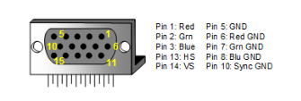
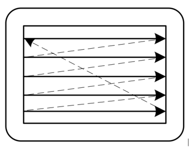
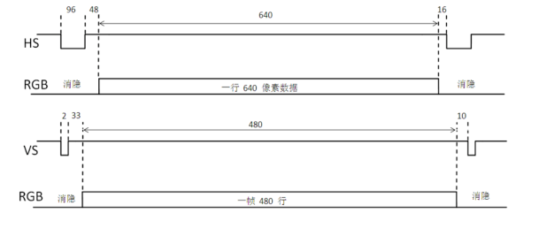
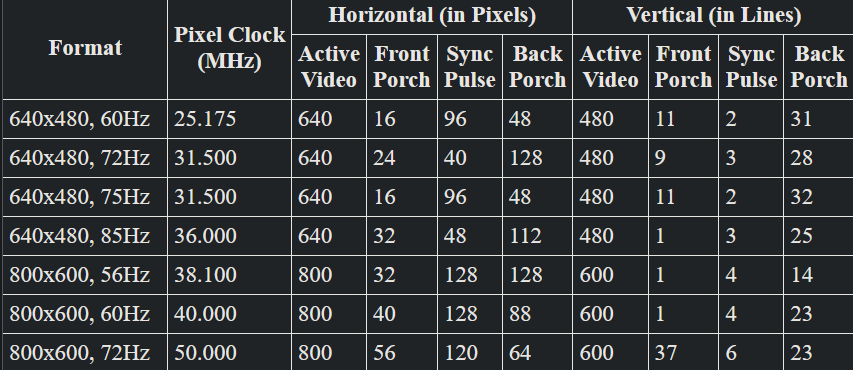
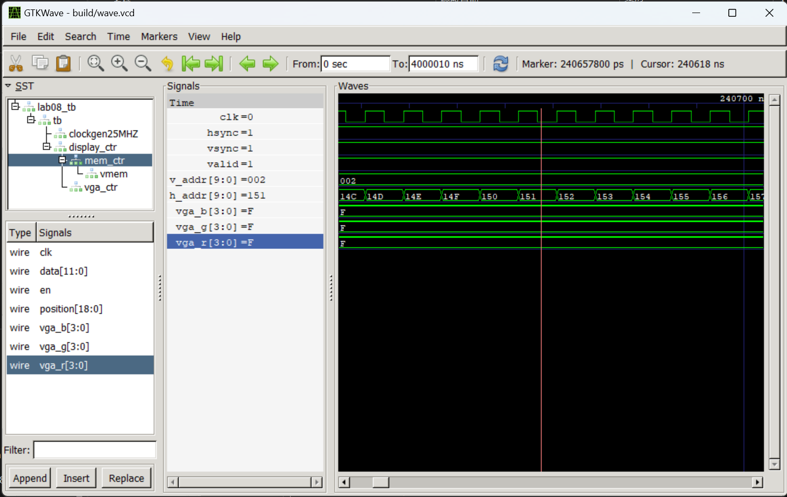
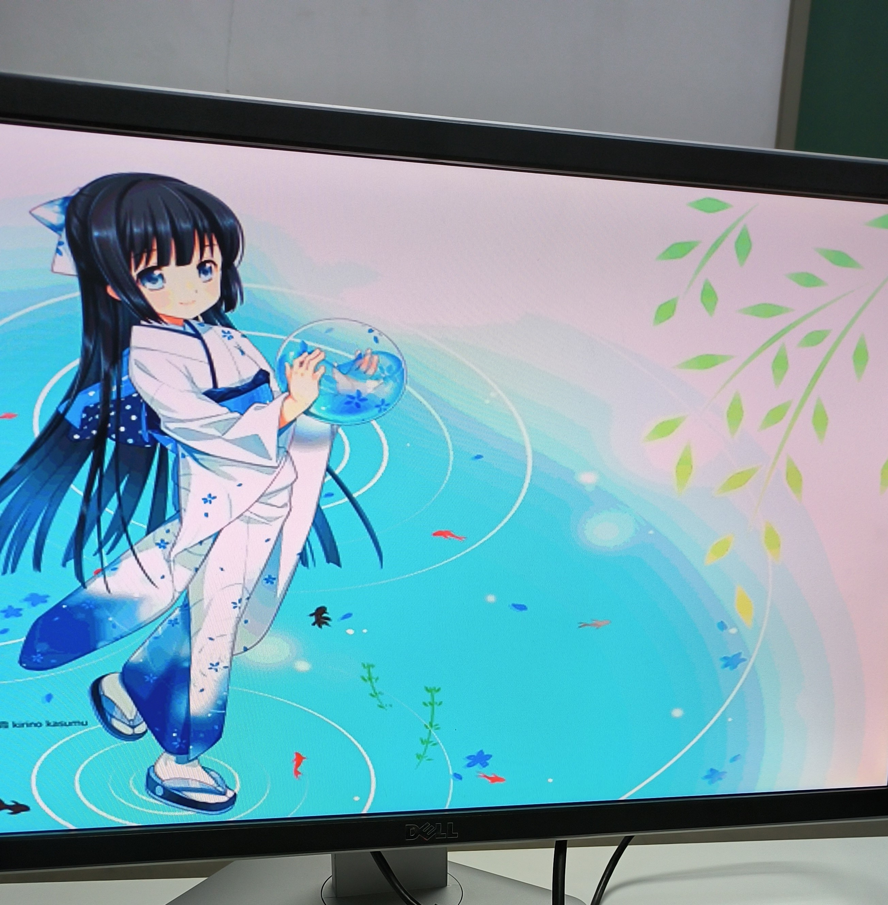

# <center>实验八	VGA 接口控制器实现<center>


## <center> 姓名：徐沐杰   <center>

## <center> 学号：211240088   <center>

## <center> 班级：1班   <center>

## <center> 邮箱：211240088@smail.nju.edu.cn   <center>

## <center> 实验时间：2022.11.26   <center>


# 实验八	VGA 接口控制器实现

## 1.实验目的

学习 VGA 接口原理，设计一个简单的 VGA 接口控制器，并利用其展示图片。

## 2.实验原理

VGA 接口信号主要由 R、G、B 三颜色通道信号及行同步与帧同步信号组成，其显示流程是自左往右，自上至下一个一个像素进行的，但由于显示组件的移动需要时间，故而存在所谓行消隐和帧消隐时间，使得 VGA 行扫描和场扫描皆呈现出特殊的时序，具体如下列图片所示。

|  |  |
| :--: | :--: |
| VGA 接口形状及信号示意图 | 显示器扫描示意图 |

|  |
| :--: |
| VGA 行扫描、场扫描时序示意图 |

各种分辨率的 VGA 扫描时序可以查表得到：
||
|:--:|
| VGA 扫描时序图 |


## 3.实验环境/器材

**硬件：** Digilent Nexys A7-100T开发板（原Nexys 4 DDR），核心芯片为 Xilinx Artix-7 FPGA芯片

**软件：** Vivado 2022.1 ML Standard

## 4.程序代码或流程图

#### 顶层模块

```verilog
module lab08(
    input   wire                clock100MHZ,
    input   wire    [15:0]      SW,
    output  wire    [3:0]       VGA_R,
    output  wire    [3:0]       VGA_G,
    output  wire    [3:0]       VGA_B,
    output  wire                VGA_HS,
    output  wire                VGA_VS,
    output  wire    [15:0]      LED
);

    wire clock25MHZ;
    clockGenerator #(.freq(`SPEED)) clockgen25MHZ(clock100MHZ, SW[0], clock25MHZ);

    assign LED[15:2] = {VGA_R, VGA_G, VGA_B, VGA_HS, VGA_VS};

    Display_Ctr display_ctr(
        .clk(clock25MHZ),
        .fclk(clock100MHZ),
        .rst(SW[0]),
        .vga_r(VGA_R),
        .vga_g(VGA_G),
        .vga_b(VGA_B),
        .hsync(VGA_HS),
        .vsync(VGA_VS),
        .valid(LED[0])
    );

endmodule
```

#### 显存模块

~~~~verilog
module RAM #(
    parameter width = 8,
    parameter addr_width = 19,
    parameter size = 2**addr_width
    //A 512KB RAM by default
)(
    input   wire    [addr_width-1:0]    read_addr,
    input   wire    [addr_width-1:0]    write_addr,
    input   wire    [width-1:0]         datain,
    input   wire                        memclk,
    input   wire                        en,
    input   wire                        wen,
    output  reg     [width-1:0]         dataout
);

    reg [width-1:0] memory [size-1:0];

    initial begin
        dataout <= 0;
    end
    
    always @(posedge memclk)
        if (en)
            dataout <= memory[read_addr];
        else
            dataout <= 0;

    always @(posedge memclk)
        if (en && wen)
            memory[write_addr] <= datain;
	initial begin
        $readmemh("shizuku1.memory", memory, 0, size - 1);
	end
endmodule
~~~~

#### VGA 控制器

````verilog
module Vga_Ctr(
    input   wire                clk,
    input   wire                rst,
    output  wire    [9:0]       h_addr,
    output  wire    [9:0]       v_addr,
    output  wire                hsync,
    output  wire                vsync,
    output  wire                valid
);

    parameter h_frontporch = `H_FRONTPROCH;
    parameter h_active = `H_ACTIVE;
    parameter h_backporch = `H_BACKPORCH;
    parameter h_total = `H_TOTAL;

    parameter v_frontporch = `V_FRONTPROCH;
    parameter v_active = `V_ACTIVE;
    parameter v_backporch = `V_BACKPORCH;
    parameter v_total = `V_TOTAL;

    reg [9:0] x_cnt, y_cnt;
    wire h_valid, v_valid;
    
    assign h_valid = (x_cnt > h_active) & (x_cnt <= h_backporch);
    assign v_valid = (y_cnt > v_active) & (y_cnt <= v_backporch);
    assign valid = h_valid & v_valid;

    assign h_addr = h_valid ? (x_cnt - h_active - 10'b1) : {10{1'b0}};
    assign v_addr = v_valid ? (y_cnt - v_active - 10'b1) : {10{1'b0}};

    assign hsync = (x_cnt > h_frontporch);
    assign vsync = (y_cnt > v_frontporch);

    always @(posedge clk, negedge rst) begin
        if(!rst)
            x_cnt <= 1;
        else begin
            if (x_cnt == h_total)
                 x_cnt <= 1;
            else
                x_cnt <= x_cnt + 10'd1;
        end
    end

    always @(posedge clk, negedge rst) begin
        if(!rst)
            y_cnt <= 1;
        else begin
            if (y_cnt == v_total & x_cnt == h_total)
                y_cnt <= 1;
            else if (x_cnt == h_total)
                y_cnt <= y_cnt + 10'd1;
        end
    end

endmodule
````

#### 显存控制器

~~~~verilog
module Mem_Ctr(
    input   wire            clk,
    input   wire    [18:0]  position,    
    input   wire            en,        
    output  wire    [3:0]   vga_r,
    output  wire    [3:0]   vga_g,
    output  wire    [3:0]   vga_b
);

    wire [11:0] data;
    
    RAM #(
        .width (12),
        .addr_width (19),
        .size (327680)
    ) vmem(
        .memclk(clk),
        .read_addr(position),
        .write_addr(19'b0),
        .datain(12'b0),
        .en(en),
        .wen(1'b0),
        .dataout(data)
    );

    assign vga_r = en ? (data[11:8]) : 4'b0;  
    assign vga_g = en ? (data[ 7:4]) : 4'b0;  
    assign vga_b = en ? (data[ 3:0]) : 4'b0;  

endmodule
~~~~

#### 主控制器

~~~~verilog
module Display_Ctr(
    input   wire            clk,
    input   wire            fclk,
    input   wire            rst,
    output  wire    [3:0]   vga_r,
    output  wire    [3:0]   vga_g,
    output  wire    [3:0]   vga_b,
    output  wire            hsync,
    output  wire            vsync,
    output  wire            valid
);

    wire [9:0] h_addr, v_addr;
    Vga_Ctr vga_ctr(
        .clk(clk),
        .rst(rst),
        .h_addr(h_addr),
        .v_addr(v_addr),
        .valid(valid),
        .hsync(hsync),
        .vsync(vsync)
    );

    wire [18:0] vmemidx;
    assign vmemidx = {h_addr, v_addr[8:0]};

    Mem_Ctr mem_ctr(
        .clk(fclk),
        .position(vmemidx),
        .en(valid),
        .vga_r(vga_r),
        .vga_g(vga_g),
        .vga_b(vga_b)
    );    


endmodule
~~~~


## 5.实验步骤/过程

1.建立 lab08 项目

2.设计并编译源文件

3.编写测试文件并仿真运行

4.设计综合

5.创建约束文件并实现

6.生成二进制文件并写入硬盘

## 6.测试方法

仿真测试与上板测试

## 7.实验结果

仿真结果：



上板结果：



## 8.实验中遇到的问题及解决办法

主要问题集中在把图片转换成 coe 文件的过程，因为给出的 python 示例代码并没有将图片转换成规定格式的 coe 文件，所以需要通读代码后进行修改，其次则是我在本次实验中没有使用 IP 核，故不能使用提供的 coe 文件进行初始化，因此我另外编写了程序再进行了一次转化。

## 9.实验得到的启示

1. 在转换文件时应当先创建一个较小的文件，验证其满足了格式之后再进行操作，避免反复对大规模文件操作浪费时间。
2. 进行大规模文件转换处理时如果耗时过长，可能是算法实现存在效率问题，应首先进行优化以节省测试的时间。

## 10.意见和建议

无